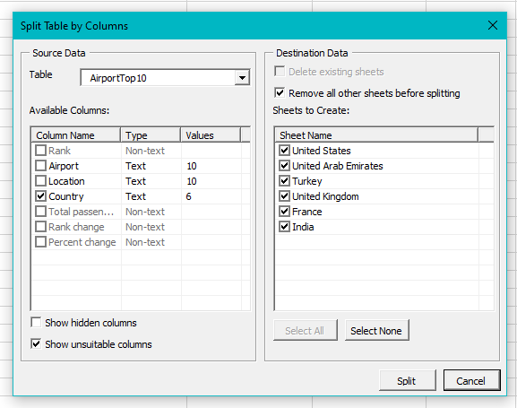
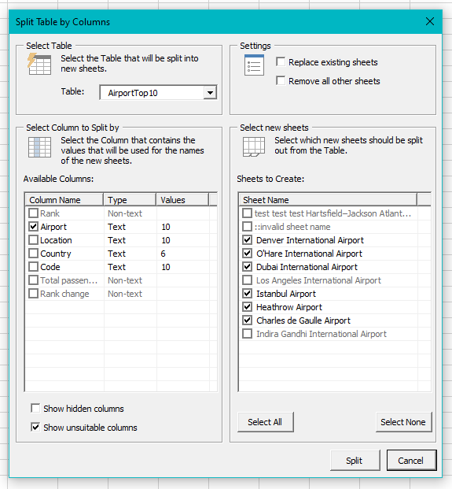

# excel-table-split-column
This is an Excel VBA tool that will split a Table into separate worksheets, based on the contents of one of the table's columns.

# Features
- ✅ Splits a Table into multiple worksheets based on the unique values in a selected column.
- ✅ Detects which columns are not suitable to split on (i.e., The column is not exclusively text.)
- ✅ Option to remove all other worksheets before splitting.
- ✅ Option to replace existing worksheets with the same name.
## Detects Invalid Sheet Names

# TODO 
- [TODO List](TODO.md)

Developed using [Rubberduck VBA](https://github.com/rubberduck-vba/Rubberduck) and [XBA Live Server](https://marketplace.visualstudio.com/items?itemName=local-smart.excel-live-server).