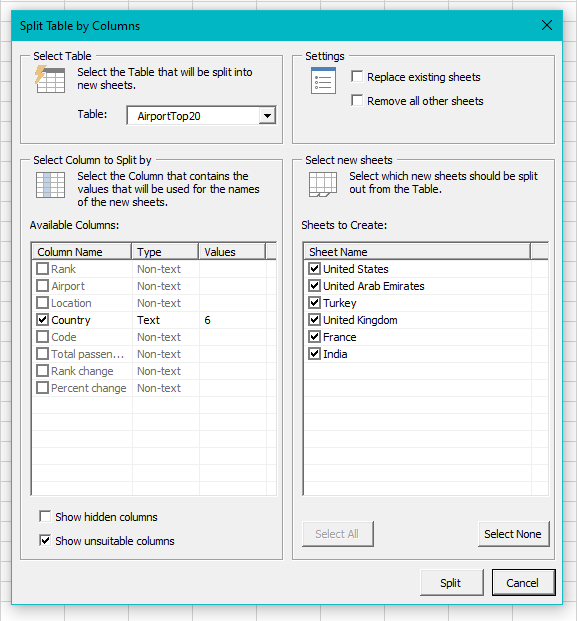

# excel-table-split-column
This is an Excel VBA tool that will split a Table into separate worksheets, based on the contents of one of the table's columns.

Developed using [Rubberduck VBA](https://github.com/rubberduck-vba/Rubberduck) and [XBA Live Server](https://marketplace.visualstudio.com/items?itemName=local-smart.excel-live-server).